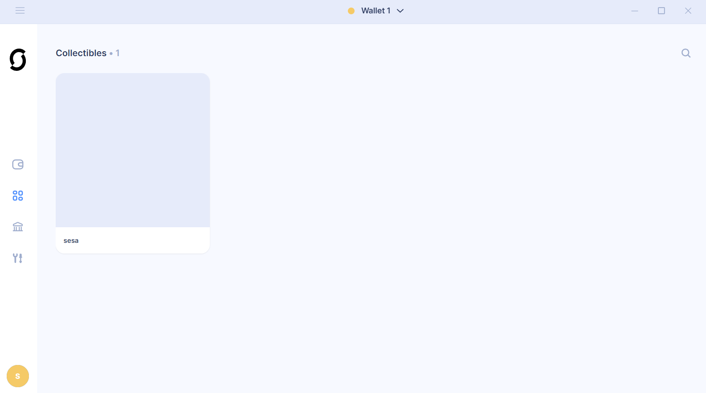

# ISC-Cross-Chain-NFT-Marketplace
This is an NFT marketplace, where NFTs are listed on Shimmer Testnet, Shimmer EVM Testnet and BNB Testnet. 

This tutorial is incremental. We will first build a Solidity NFT market place on Shimmer EVM, then support L1 (Shimmer Testnet), and then support BNB Testnet

## Pre-requisites

### 1-An NFT on Shimmer Testnet (L1)
a- [create a free NFT URI with IPFS UI](https://docs.ipfs.tech/quickstart/publish/#upload-and-pin-a-file). After following the attached tutorial stpes, you should end-up with an URI that looks like this: https://bafybeie6w27lslyrvw4ppnj2l3zpdbpvywyhdt6npwwgpkiv7paoemqldq.ipfs.w3s.link/

b- Then, Download fiefly wallet, and create a Shimmer Testnet account. Go to https://faucet.testnet.shimmer.network/ and fund your account with some SMR tokens.

c- enable `developer-mode`

d- go to `mint-nft`. In URI section, paste the NFT URI generated in step 1 in the URI section

After following the above steps, you should end-up with an NFT under your `collectibles` section:

